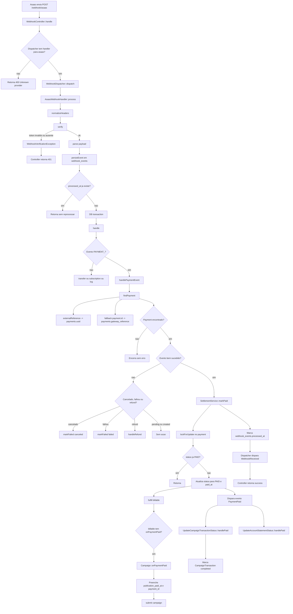

# Webhook Asaas: fluxo de `PAYMENT_RECEIVED`

## Objetivo

Documentar como o projeto processa um webhook do Asaas quando chega um pagamento confirmado/recebido, com foco em `PAYMENT_RECEIVED`.

Exemplo de payload recebido:

```json
{
  "id": "evt_d26e303b238e509335ac9ba13221",
  "event": "PAYMENT_RECEIVED",
  "dateCreated": "2025-07-15 21:53:29",
  "payment": {
    "object": "payment",
    "id": "pay_mock_1fe292f6-1c5a-4ea0-90de-048ac350c353",
    "dateCreated": "2025-07-15",
    "customer": "cus_000126279930",
    "checkoutSession": null,
    "paymentLink": null,
    "value": 5,
    "netValue": 4.01
  }
}
```

## Endpoint de entrada

O webhook pode entrar por duas rotas:

- [routes/web.php#L13](d:/laragon/www/Projetos/UGC/ugc_app/routes/web.php#L13): `POST /webhook/{provider}`
- [routes/api.php#L154](d:/laragon/www/Projetos/UGC/ugc_app/routes/api.php#L154): `POST /api/v1/payments/webhooks/{provider}`

O setup automático do Asaas aponta para:

- [app/Modules/Payments/Gateways/Asaas/Services/WebhooksService.php#L301](d:/laragon/www/Projetos/UGC/ugc_app/app/Modules/Payments/Gateways/Asaas/Services/WebhooksService.php#L301): `APP_URL/webhook/asaas`

Na prática, a URL esperada pelo projeto para o Asaas é:

```text
POST /webhook/asaas
```

## Visão geral

O [WebhookController](d:/laragon/www/Projetos/UGC/ugc_app/app/Modules/Payments/Http/Controllers/WebhookController.php) não implementa a regra de negócio do pagamento. Ele apenas:

1. valida o provider;
2. delega para o `WebhookDispatcher`;
3. devolve a resposta HTTP.

O processamento real do Asaas acontece em:

- [app/Modules/Payments/Webhooks/WebhookDispatcher.php](d:/laragon/www/Projetos/UGC/ugc_app/app/Modules/Payments/Webhooks/WebhookDispatcher.php)
- [app/Modules/Payments/Gateways/Asaas/Webhooks/AsaasWebhookHandler.php](d:/laragon/www/Projetos/UGC/ugc_app/app/Modules/Payments/Gateways/Asaas/Webhooks/AsaasWebhookHandler.php)
- [app/Modules/Payments/Services/SettlementService.php](d:/laragon/www/Projetos/UGC/ugc_app/app/Modules/Payments/Services/SettlementService.php)

## Fluxo Mermaid



## Sequência detalhada

### 1. Entrada HTTP

O método [handle() em WebhookController.php#L33](d:/laragon/www/Projetos/UGC/ugc_app/app/Modules/Payments/Http/Controllers/WebhookController.php#L33):

- transforma o provider em minúsculo;
- verifica se existe handler registrado;
- chama `WebhookDispatcher::dispatch($provider, $request)`;
- retorna:
  - `400` se o provider não existir;
  - `401` se a verificação do webhook falhar;
  - `200` com `success: false` em erro genérico;
  - `200` com `success: true` quando o fluxo termina.

### 2. Registro do handler do Asaas

O handler é registrado no provider do módulo:

- [app/Modules/Payments/PaymentServiceProvider.php#L167](d:/laragon/www/Projetos/UGC/ugc_app/app/Modules/Payments/PaymentServiceProvider.php#L167)
- [app/Modules/Payments/PaymentServiceProvider.php#L178](d:/laragon/www/Projetos/UGC/ugc_app/app/Modules/Payments/PaymentServiceProvider.php#L178)

Fluxo:

1. `PaymentServiceProvider` registra `AsaasWebhookHandler`;
2. `WebhookDispatcher` recebe `registerHandler('asaas', ...)`;
3. `WebhookController` passa o provider `asaas`;
4. o dispatcher resolve o handler correto.

### 3. Dispatcher

O método [dispatch() em WebhookDispatcher.php#L71](d:/laragon/www/Projetos/UGC/ugc_app/app/Modules/Payments/Webhooks/WebhookDispatcher.php#L71):

1. busca o handler pelo nome do gateway;
2. faz log de recebimento;
3. chama `process($request)` no handler;
4. dispara o evento Laravel `WebhookReceived`;
5. devolve o registro salvo em `webhook_events`.

### 4. Verificação do webhook do Asaas

A verificação acontece em [AsaasWebhookHandler.php#L71](d:/laragon/www/Projetos/UGC/ugc_app/app/Modules/Payments/Gateways/Asaas/Webhooks/AsaasWebhookHandler.php#L71).

Regra:

- em ambiente local, a verificação é pulada;
- fora de ambiente local, o valor de `payments.gateways.asaas.webhook_secret` precisa existir;
- o header esperado é `asaas-access-token`;
- se o token estiver ausente ou inválido, o handler lança `WebhookVerificationException`.

O helper que extrai esse header fica em [AsaasWebhookHandler.php#L368](d:/laragon/www/Projetos/UGC/ugc_app/app/Modules/Payments/Gateways/Asaas/Webhooks/AsaasWebhookHandler.php#L368).

### 5. Parse do payload

O parse acontece em [AsaasWebhookHandler.php#L120](d:/laragon/www/Projetos/UGC/ugc_app/app/Modules/Payments/Gateways/Asaas/Webhooks/AsaasWebhookHandler.php#L120).

Campos relevantes do payload:

- `payload.id` -> `providerEventId`
- `payload.event` -> `providerEventType`
- `payload.payment.id` -> `providerPaymentId`
- `payload.payment.customer` -> `customerId`
- `payload.payment.subscription` -> `subscriptionId`
- `payload.payment.externalReference` -> `paymentUuid`

Mapeamento do evento:

- `PAYMENT_CONFIRMED` -> `PaymentEventType::PAYMENT_CONFIRMED`
- `PAYMENT_RECEIVED` -> `PaymentEventType::PAYMENT_RECEIVED`

Referências:

- [AsaasWebhookHandler.php#L31](d:/laragon/www/Projetos/UGC/ugc_app/app/Modules/Payments/Gateways/Asaas/Webhooks/AsaasWebhookHandler.php#L31)
- [PaymentEventType.php#L17](d:/laragon/www/Projetos/UGC/ugc_app/app/Modules/Payments/Enums/PaymentEventType.php#L17)

### 6. Idempotência

A persistência ocorre em [AsaasWebhookHandler.php#L348](d:/laragon/www/Projetos/UGC/ugc_app/app/Modules/Payments/Gateways/Asaas/Webhooks/AsaasWebhookHandler.php#L348) com `firstOrCreate`.

Chave prática de idempotência:

- `provider`
- `provider_event_id`
- `event_type`

Se o evento já tiver `processed_at`, ele é ignorado em:

- [AsaasWebhookHandler.php#L186](d:/laragon/www/Projetos/UGC/ugc_app/app/Modules/Payments/Gateways/Asaas/Webhooks/AsaasWebhookHandler.php#L186)

Model:

- [app/Modules/Payments/Models/WebhookEvent.php](d:/laragon/www/Projetos/UGC/ugc_app/app/Modules/Payments/Models/WebhookEvent.php)

### 7. Tratamento do `PAYMENT_RECEIVED`

O tratamento entra em [AsaasWebhookHandler.php#L253](d:/laragon/www/Projetos/UGC/ugc_app/app/Modules/Payments/Gateways/Asaas/Webhooks/AsaasWebhookHandler.php#L253).

Lógica:

1. procura o pagamento local;
2. monta um `context` com payload e timestamp de recebimento;
3. como `PAYMENT_RECEIVED` é um evento de sucesso, chama:

```php
$this->settlement->markPaid($payment, $context);
```

O sucesso é decidido por:

- [PaymentEventType.php#L17](d:/laragon/www/Projetos/UGC/ugc_app/app/Modules/Payments/Enums/PaymentEventType.php#L17)

### 8. Como o pagamento é encontrado

Busca implementada em [AsaasWebhookHandler.php#L324](d:/laragon/www/Projetos/UGC/ugc_app/app/Modules/Payments/Gateways/Asaas/Webhooks/AsaasWebhookHandler.php#L324).

Ordem:

1. `payment.externalReference` -> busca em `payments.uuid`
2. fallback `payment.id` -> busca em `payments.gateway_reference`

Com o payload de exemplo:

- `event = PAYMENT_RECEIVED`
- `provider_event_id = evt_d26e303b238e509335ac9ba13221`
- `providerPaymentId = pay_mock_1fe292f6-1c5a-4ea0-90de-048ac350c353`

Se `externalReference` não vier, o sistema só conciliará se existir um registro com:

```text
payments.gateway_reference = pay_mock_1fe292f6-1c5a-4ea0-90de-048ac350c353
```

### 9. Liquidação do pagamento

O método [markPaid() em SettlementService.php#L18](d:/laragon/www/Projetos/UGC/ugc_app/app/Modules/Payments/Services/SettlementService.php#L18):

1. abre transação;
2. recarrega o payment com `lockForUpdate()`;
3. se já estiver `PAID`, retorna;
4. valida se o status atual pode virar `PAID`;
5. atualiza:
   - `status = PAID`
   - `paid_at = now()`
   - `meta.settlement`
6. executa `fulfill($payment)`;
7. dispara `PaymentPaid`.

Estados permitidos para virar pago:

- `PENDING`
- `REQUIRES_ACTION`
- `DRAFT`

Referência:

- [SettlementService.php#L126](d:/laragon/www/Projetos/UGC/ugc_app/app/Modules/Payments/Services/SettlementService.php#L126)

### 10. Efeito de negócio em campanhas

No caso de campanha, `fulfill()` chama `onPaymentPaid()` do billable:

- [SettlementService.php#L166](d:/laragon/www/Projetos/UGC/ugc_app/app/Modules/Payments/Services/SettlementService.php#L166)
- [Campaign.php#L513](d:/laragon/www/Projetos/UGC/ugc_app/app/Models/Campaign.php#L513)

O método `Campaign::onPaymentPaid()`:

1. valida se a campanha está em `AWAITING_PAYMENT`;
2. preenche:
   - `publication_paid_at`
   - `publication_payment_method`
   - `publication_payment_id`
3. chama `submit()`.

Em falha/cancelamento, a campanha usa:

- [Campaign.php#L532](d:/laragon/www/Projetos/UGC/ugc_app/app/Models/Campaign.php#L532)

### 11. Eventos e listeners disparados

Depois de marcar o pagamento como pago, o sistema dispara:

- [app/Modules/Payments/Events/PaymentPaid.php](d:/laragon/www/Projetos/UGC/ugc_app/app/Modules/Payments/Events/PaymentPaid.php)

Os listeners são registrados em:

- [app/Providers/AppServiceProvider.php#L44](d:/laragon/www/Projetos/UGC/ugc_app/app/Providers/AppServiceProvider.php#L44)
- [app/Providers/AppServiceProvider.php#L64](d:/laragon/www/Projetos/UGC/ugc_app/app/Providers/AppServiceProvider.php#L64)

Impactos encontrados:

- [UpdateCampaignTransactionStatus.php#L24](d:/laragon/www/Projetos/UGC/ugc_app/app/Listeners/Campaign/UpdateCampaignTransactionStatus.php#L24)
  - marca `CampaignTransaction` como `completed`
- `UpdateAccountStatementStatus::handlePaid`
  - atualiza extrato/statement da conta

## Mapa das funções envolvidas

### Entrada

- [WebhookController::handle()](d:/laragon/www/Projetos/UGC/ugc_app/app/Modules/Payments/Http/Controllers/WebhookController.php#L33)
- [WebhookDispatcher::dispatch()](d:/laragon/www/Projetos/UGC/ugc_app/app/Modules/Payments/Webhooks/WebhookDispatcher.php#L71)

### Handler Asaas

- [AsaasWebhookHandler::process()](d:/laragon/www/Projetos/UGC/ugc_app/app/Modules/Payments/Gateways/Asaas/Webhooks/AsaasWebhookHandler.php#L172)
- [AsaasWebhookHandler::verify()](d:/laragon/www/Projetos/UGC/ugc_app/app/Modules/Payments/Gateways/Asaas/Webhooks/AsaasWebhookHandler.php#L71)
- [AsaasWebhookHandler::parse()](d:/laragon/www/Projetos/UGC/ugc_app/app/Modules/Payments/Gateways/Asaas/Webhooks/AsaasWebhookHandler.php#L120)
- [AsaasWebhookHandler::handle()](d:/laragon/www/Projetos/UGC/ugc_app/app/Modules/Payments/Gateways/Asaas/Webhooks/AsaasWebhookHandler.php#L149)
- [AsaasWebhookHandler::handlePaymentEvent()](d:/laragon/www/Projetos/UGC/ugc_app/app/Modules/Payments/Gateways/Asaas/Webhooks/AsaasWebhookHandler.php#L253)
- [AsaasWebhookHandler::findPayment()](d:/laragon/www/Projetos/UGC/ugc_app/app/Modules/Payments/Gateways/Asaas/Webhooks/AsaasWebhookHandler.php#L324)
- [AsaasWebhookHandler::persistEvent()](d:/laragon/www/Projetos/UGC/ugc_app/app/Modules/Payments/Gateways/Asaas/Webhooks/AsaasWebhookHandler.php#L348)

### Liquidação

- [SettlementService::markPaid()](d:/laragon/www/Projetos/UGC/ugc_app/app/Modules/Payments/Services/SettlementService.php#L18)
- [SettlementService::fulfill()](d:/laragon/www/Projetos/UGC/ugc_app/app/Modules/Payments/Services/SettlementService.php#L166)

### Regras de campanha

- [Campaign::onPaymentPaid()](d:/laragon/www/Projetos/UGC/ugc_app/app/Models/Campaign.php#L513)
- [Campaign::onPaymentFailed()](d:/laragon/www/Projetos/UGC/ugc_app/app/Models/Campaign.php#L532)
- [UpdateCampaignTransactionStatus::handlePaid()](d:/laragon/www/Projetos/UGC/ugc_app/app/Listeners/Campaign/UpdateCampaignTransactionStatus.php#L24)
- [UpdateCampaignTransactionStatus::handleFailed()](d:/laragon/www/Projetos/UGC/ugc_app/app/Listeners/Campaign/UpdateCampaignTransactionStatus.php#L59)

## Pontos de atenção encontrados na análise

### 1. Webhook pode ser marcado como processado sem encontrar o pagamento

Em [AsaasWebhookHandler.php#L255](d:/laragon/www/Projetos/UGC/ugc_app/app/Modules/Payments/Gateways/Asaas/Webhooks/AsaasWebhookHandler.php#L255), se `findPayment()` não achar o registro local, o método retorna sem erro. Mesmo assim, o fluxo segue e o webhook recebe `processed_at`.

Impacto:

- pode haver perda silenciosa de conciliação;
- o evento fica com aparência de sucesso sem ter liquidado nenhum `Payment`.

### 2. Erro pode não ficar persistido no `webhook_events`

No `catch` de [AsaasWebhookHandler.php#L200](d:/laragon/www/Projetos/UGC/ugc_app/app/Modules/Payments/Gateways/Asaas/Webhooks/AsaasWebhookHandler.php#L200), o código atualiza `error_message` e `attempts`, mas isso está dentro da mesma transação que relança a exceção.

Impacto provável:

- o update pode sofrer rollback;
- o banco pode não refletir a falha real do processamento.

### 3. Erro genérico retorna HTTP 200

Em [WebhookController.php#L69](d:/laragon/www/Projetos/UGC/ugc_app/app/Modules/Payments/Http/Controllers/WebhookController.php#L69), erros genéricos devolvem `200` com `success: false`.

Impacto:

- o Asaas pode entender que a entrega foi aceita;
- retries automáticos podem não acontecer.

### 4. Duas rotas para webhook

Há rota em `web.php` e em `api.php`, mas o setup do Asaas usa `/webhook/asaas`.

Impacto:

- é importante documentar e padronizar qual endpoint é o oficial;
- evita configuração divergente entre ambientes.

## Resumo executivo

Quando o Asaas envia `PAYMENT_RECEIVED`, o projeto:

1. recebe o POST em `WebhookController`;
2. delega para `WebhookDispatcher`;
3. o `AsaasWebhookHandler` valida o token;
4. parseia o payload;
5. persiste o evento em `webhook_events`;
6. evita reprocessamento se já houver `processed_at`;
7. localiza o `Payment`;
8. chama `SettlementService::markPaid()`;
9. atualiza o pagamento para `PAID`;
10. executa a regra do billable, como `Campaign::onPaymentPaid()`;
11. dispara `PaymentPaid` e listeners auxiliares;
12. marca o webhook como processado.
